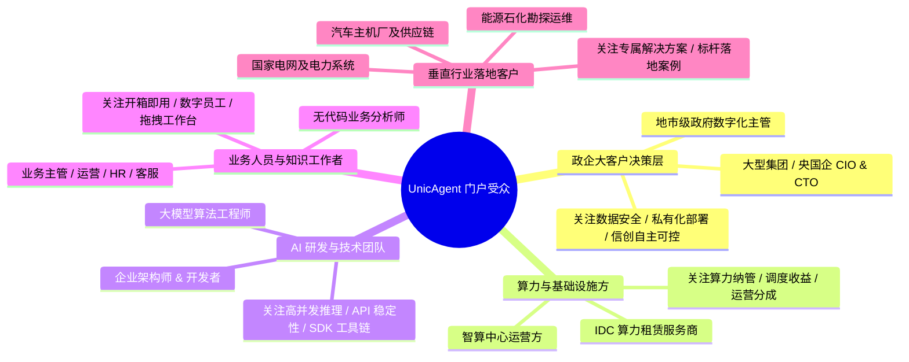

# UnicAgent 企业门户定位受众与信息架构规范 (PORTAL_ARCHITECTURE.md)

> **版本**：v1.0.0  
> **文档目标**：厘清 UnicAgent 企业门户的核心定位、目标受众画像、信息架构（IA）及页面映射关系，作为原型构建与后续 AI Coding 的指导准则。

---

## 1. 门户定位与核心主张

### 1.1 一句话定位
> **UnicAgent 企业级智能体与大模型网关平台**  
> 全栈打通「AI 算力纳管」、「大模型服务网关」、「低代码智能体开发」与「企业私有化交付」，赋能产业数字化转型的一站式 AI 基础设施。

### 1.2 门户传递的核心心智 (Brand Mental Model)
- **成熟可靠**：具备企业级 SLA、99.99% 高可用保障、完备安全隔离与审计体系。
- **全场景覆盖**：从最底层算力调度、中间层模型网关，到上层低代码/专业代码智能体开发。
- **信创与私有化**：深度适配国产算力芯片（昇腾、海光、寒武纪等），支持政企集团完全私有化部署。
- **灵活商业模式**：支持按量付费、预留实例、私有化买断、以及算力与运营分成合作。

---

## 2. 目标受众与用户画像全景矩阵 (Personas)



### 详细角色画像与诉求映射表

| 受众分类 | 代表角色 | 业务痛点 / 核心诉求 | 门户承载板块 | 转化目标行为 |
| :--- | :--- | :--- | :--- | :--- |
| **大型集团 / 央国企** | 集团 CIO、数字化总监、政企信息安全主管 | 敏感数据不能出域、现有系统异构复杂、需要信创合规交付、关注软硬件整合方案 | **私有化部署服务平台**、行业解决方案、客户案例与资质背书 | 预约售前咨询、申请私有化架构方案白皮书 |
| **算力中心 / IDC 伙伴** | 智算中心总经理、算力租赁销售总监 | GPU 算力利用率不稳定、多卡调度门槛高、缺乏上层商业生态变现渠道 | **AI 算力运营服务**（营销介绍、调度架构、分成测算） | 申请成为算力伙伴、接入算力集群测算收益 |
| **模型开发者 / Token 提供方** | 算法技术总监、AI 初创团队负责人 | 模型部署成本高、多模型切换复杂、缺乏流控计费一体化网关 | **大模型服务网关**、**大模型广场**（模型清单、评测） | 注册账号、申请 API 密钥、充值测试 |
| **企业业务人员 / 无代码开发者** | 业务线主管、运营专家、行政/HR 管理者 | 缺乏专业研发支持、希望用 AI 快速解决业务痛点、流程繁琐耗时 | **智能体开发平台 - 数字员工平台**、**智能体工作台** | 体验数字员工、进入拖拽工作台试用模板 |
| **软件工程师 / 架构师** | 高级研发工程师、ISV 解决方案集成商 | 需将 AI 深度集成至自研 ERP/CRM、多智能体协同机制复杂 | **智能体开发套件（SDK）**、**开发者文档**、API 广场 | 查阅 API/SDK 文档、体验 Playground 调试 |
| **垂直行业用户** | 汽车制造主管、电力运维主任、能源安全总监 | 通用大模型不接地气、需要行业深度 Know-How 与场景专属闭环 | **行业解决方案**（汽车/电力/能源/通用对练与工牌） | 索取行业白皮书、联系行业专家沟通定制 |
| **采购与财务决策人** | 采购经理、财务总监 | 计费不透明、成本预算不可控、缺乏灵活采购套餐 | **定价页面**（套餐对比、API 充值计算器） | 选择合适套餐发起采购流程 |

---

## 3. 全站导航信息架构 (Information Architecture)

根据产品经理给出的规划，全站导航结构与路由映射如下：

```text
UnicAgent 企业门户
├── 1. 首页 (/)
│   ├── 首屏大轮播 (Hero) —— 一句话定位 + 核心动态
│   ├── 信任背书与核心指标 (Metrics & Logo Wall)
│   ├── 核心业务矩阵 (4 大业务卡片)
│   │   ├── AI 算力运营服务（面向算力租赁提供商）
│   │   ├── 大模型服务网关（面向 Token 提供商）
│   │   ├── 智能体开发平台（全栈能力）
│   │   └── 私有化部署服务平台（面向央国企/政府）
│   ├── 为什么选择 UnicAgent (6 大核心优势)
│   ├── 热门大模型预览与快速体验
│   ├── 行业解决方案简略版 (汽车/电力/能源/通用)
│   ├── 标杆客户评价与实战背书
│   └── 底部行动转化卡片 (CTA)
│
├── 2. 智能体开发平台 (/agent-platform)
│   ├── 平台全景能力介绍 (办公场景 / 业务开发 / 代码开发)
│   ├── 子模块 1: 数字员工平台 (/agent-platform/digital-employee)
│   │   └── 开箱即用工作台、角色预设库、购买与体验引导
│   ├── 子模块 2: 智能体工作台 (/agent-platform/workbench)
│   │   └── 无代码低代码可视化拖拽编排、知识库挂载、插件配置
│   └── 子模块 3: 智能体开发套件 (/agent-platform/sdk)
│       └── 面向研发人员的 SDK、多智能体协作框架、系统整合
│
├── 3. 大模型广场 (/models)
│   ├── 全量已部署模型清单 (分类筛选 / 搜索 / 排序)
│   ├── 实时报价明细 (输入/输出单价、并发配额、延迟)
│   ├── 模型详情抽屉 (SideSheet: 评测数据、支持参数、API 快速接入代码)
│   └── 大模型体验中心 (/models/playground)
│       ├── 单模型 Playground 对话实测
│       └── 多模型 Arena 盲测与对比体验
│
├── 4. 定价与商业化 (/pricing)
│   ├── 周期套餐购买 (初创版 / 专业版 / 企业尊享版权益横向对比)
│   ├── API 充值服务 (Token 充值阶梯折扣计算器)
│   └── 私有化与伙伴分成测算 (预约顾问)
│
├── 5. 行业解决方案 (/solutions)
│   ├── 汽车行业解决方案 (/solutions/auto)
│   ├── 电力行业解决方案 (/solutions/power)
│   ├── 能源行业解决方案 (/solutions/energy)
│   └── 通用场景解决方案 (/solutions/general - AI 工牌、AI 对练)
│
└── 6. 开发者文档 (/docs-center)
    ├── 快速入门指南
    ├── API 参考手册
    └── SDK 工具链
```

---

## 4. 硅基流动首页高保真对齐细节

| 硅基流动板块 | UnicAgent 对应落地板块 | 核心交互与展示要点 |
| :--- | :--- | :--- |
| **顶部 Header** | `PortalHeader` | 毛玻璃透明吸顶，带 MegaMenu 下拉，清晰区分“产品矩阵”、“行业方案”、“定价”与“进入控制台” |
| **Hero Carousel** | `HeroCarousel` | 3 幅高质量轮播，大标题渐变紫、动态光晕背景、大 CTA 按钮 |
| **合作伙伴 LOGO 墙** | `TrustLogoWall` | 滚动/静态结合的知名客户与生态伙伴 LOGO，直击“成熟、可信任”心智 |
| **产品矩阵 (4 Tabs)** | `ProductMatrixSection` | 切换 AI 算力运营、大模型服务网关、智能体开发平台、私有化部署服务平台 |
| **为什么选择硅基流动 (6 优势)** | `AdvantageSection` | 3x2 网格：高速推理、高性价比、高稳定性、丰富智能、安全合规、自主可控 |
| **大模型 API 体验列表** | `ModelPlaygroundSection` | 模型列表卡片，支持直接唤起详情抽屉与测试对比 |
| **面向不同行业的解决方案** | `SolutionSection` | 汽车、电力、能源、通用场景联动切换，展示场景架构图与效果指标 |
| **典型客户和合作伙伴评价** | `TestimonialSection` | 真实案例引言、代表性客户头衔与收益数据 |
| **底部立即体验 CTA** | `CtaBannerSection` | 全屏宽深色渐变卡片，高对比度按钮 |
| **页脚 Footer** | `PortalFooter` | 结构化四列链接 + 版权与工信部合规备案说明 |
